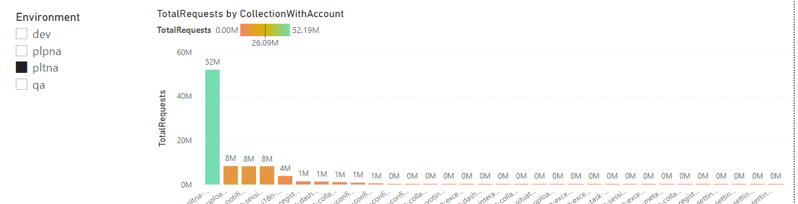
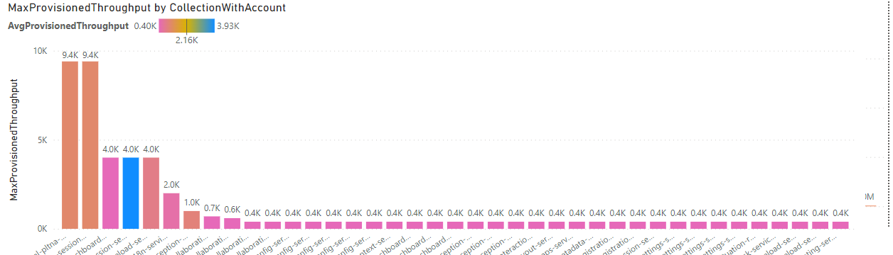
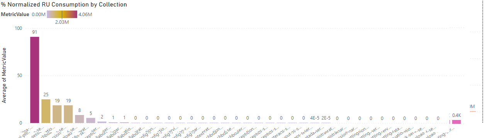
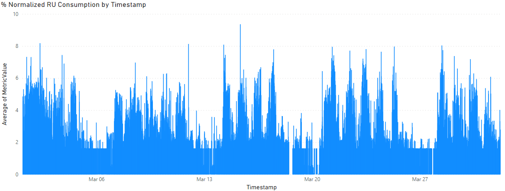

# utils
generic utils

## Run the scripts

    ./cosmosmetrics/getcosmosmetrics.sh
    ./cosmosmetrics/getcosmosthroughput.sh

## Visualize the data
The data collection can be visualized using power bi as shown below. 

